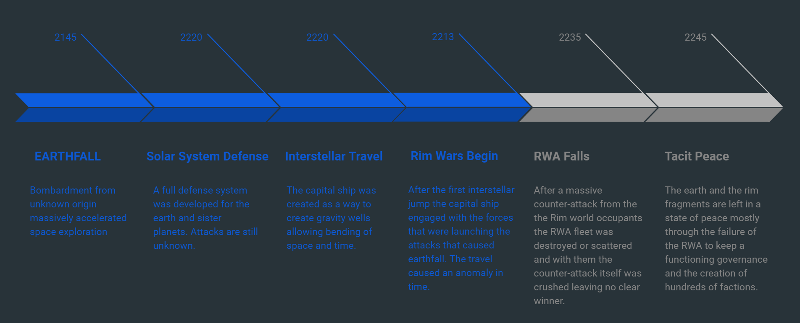

# World Info

## Political Entities

Rim World Alliance (RWA) - A now defunct organization that initially settled the Rim worlds and created most of the infrastructure that is crumbling. They failed 30 years ago due to political strife and each Rim world splintering off into their own factions.

## History

A series of events starting with the bombardment of earth caused the devastation and expansion of the human race into distant stars.  Wars and mayhem was unleashed on the enemies of the earth leading to the current Rim worlds.

### Earthfall

Meteors rained down from the skies, coming in from somewhere outside of the solar system. It was identified early on that the earth was under attack due to attacks coming precisely every six months. The attacks caused massive flooding and earthquakes across the entire planet. For the first few years humans were forced to become nomads moving across the earth to just survive.

It was during this time that almost all resources were focused on getting off the planet with as many people as possible.  After a time the earth began to lose it's atmosphere but the earthlings were able to escape to mars and began to colonize the rest of the planets in the solar system.  Despite this most of the manufacturing was still performed on earth due to the prevalence of rare materials that were too difficult to find and refine.  

The first 10 years of the bombardment humans nearly went extinct due to famine, and limited water. A few underground facilities managed to secure a consistent base for providing food and basic supplies for both terrestrial populations that had not been killed and those in near orbit.

### Solar System Defense

It was another 30 years before humanity could defend itself against the meteor attacks. Around this time the solar system defense network was brought on-line. It was able to steer meteors into the sun away from the earth.

The defense system consisted of arrays of millions of planetoids and several high powered telescopes. It was an automated system that would latch on to any objects with an earthbound trajectory, then create small gravity wells by moving the millions of planetoids to intercept and steer the objects.  This finally allowed humanity the ability to start to move beyond basic survival. 

Taking lessons learned from the miniature gravity wells in the defense network, Professor Maximilian VonHausen discovered a way to focus gravitons to have them flow in specific directions. This behavior was only visible under massive stresses of the planetoid network.  It was found that eddies could be created that caused time and space to fold and then snap producing a moment when matter could be transported to a new place.

### Interstellar Travel

It was only 1 month after creation of the solar system defense that the first basic craft transported a human faster than light. The only issue was it took almost the entire defense system coordinated planetoids to create the effect. It was determined that the best course of action was to build a specialized ship that focused on creating the effect.

Before VonHausen could see the results of his efforts his death came due to a stroke. Despite the setback his team heralded an advance in the final design of the Capital Ship. His death had an unfortunate consequence, it left several areas of the design with flaws that the team could not resolve. Since it was the only way to prevent the attacks the decision was made to continue anyway knowing there would be unknowns.

Due to the size, alone the ship could not be constructed near any planetary bodies due to it's gravitational pull. The gravity effects caused objects outside of it's sphere of influence to be atomized by a massive stream of focused gravity that would twist on itself and pulverize anything nearby. This meant that material and construction was primarily one of logistics of getting an enormous amount of fabricated materials to a destination far away.

The construction took nearly 50 years and relied on a force that consisted of almost half of all humanity at the time. The constant famines and occasional meteor strikes that still would slip by the solar system defense network focused everyone on building the ship to stop the barrage. Due to the size of the ship it was capable of housing millions of people and able to bring an entire fleet with it.

After the first few trips across the solar system the capital ships target was selected. There wasn't a precise location but merely a section of space that was at the edge of the milky way galaxy.  Nearly 80 years after the initial flight was proven the first true test of the Capital ship began. A jump that was thousands of light years away would be the last jump the ship made.

### Rim Wars Begin

As the capital ship started it's jump there was a massive increase in total mass on the ship. This caused a calibration error not in distance or location but rather in time.  The thought at the time was that during large jumps there was some absorption of dark matter along the path. It was this sudden inclusion of dark matter in the core of the ship that caused the system to have to adjust while in transit. The result was going back in time almost 70 years. Because of this all future faster than light trips were halted on the Capital Ship due to the extreme danger.

The Capital Ship did arrive at exactly the location that was planned. Upon arriving there was a large planet orbiting a white star that appeared to be a sub-giant.  At the edge of this solar system was a field of rocky debris. Scanning this field revealed machinery that accelerated each rock to a massive velocity and sent it hurtling towards earth. Attempts were made to reach out to the people inhabiting the planet but there was never a response.

After a period of 3 earth days a salvo of rockets headed toward the Capital Ship from the planet surface. Using a secret weapon on-board the Capital Ship a massive gravity wave was sent to the planet causing it to fragment into large pieces as if sliced from a cake each piece was not harmed but now was just a small planetoid.  Although life still existed on the planet the intelligent life seemed to be focused on a few small areas were all completely destroyed by the gravity weapon.

Shortly after the attack on the planet thousands of ships poured in to the system. There was never a single successful communication with any of the ships despite many attempts. The fleet that was part of the Capital Ship deployed and began the war in earnest.  Despite all of the combat, all ships captured were always found empty despite the ships clearly only being operable by a humanoid.

After 20 years of fighting a massive counter-attack was launched by the remaining Rim occupants. The fleet was mostly destroyed and left adrift and the counter-attack failed leaving even more ships behind. It was the end of the Rim wars. The assumption was that the Capital Ship was going to return to earth but another jump was never made.

### RWA Falls

The Rim World Alliance began to falter when the military began to disband. With no clear enemy, hundreds of years of weapon technology and a people with no purpose began to eat itself. It started with the small fleets breaking off in to smaller groups that self governed and sometimes turned to crime. Then later larger factions left for small remnants of life on the Rim world.  

It was around the same time that the RWA finally disbanded, leaving most of the military in charge of the heavy weapons but other ships were just parceled out to those with no home or duty.

### Tacit Peace

A few trading posts were formed that offered a form of parley between different factions allowing mostly safe bargaining places and places for factions to trade information. With no central governance mercenaries and private forces do most of the enforcing.

# Flora & Fauna

## Known Space Entities

* Ikaroa - An enormous fish that floats through the known universe, while alive it produces a plasma field it uses to propel itself. There are rumors of it being a magical creature but on death it appears to be similar to a normal fish and doesn't seem to possess any way of producing the plasma field or anything other than what you would find in a normal terrestrial fish. It was named after the legend of the Goddess Ikaroa from Māori mythos.

# Spacecraft

## Military

### Heavy Craft

* Capital Ship - There only remains a single capital ship which has closed itself off from the rest of the union when the military broke from the RWA.

* Battlecruiser - There are 2 remaining battle-cruisers that are derelict. There are rumors of a third that is operated by a pirate nation but this is only a rumor.

* Carrier - Focused on delivering a large number of attack vehicles quickly to a destination then jumping out.

### Medium Craft

* Corvette - There is a small fleet of corvettes, most major empires have a corvette as the standard of their fleet.

* Light Cruiser - Used to coordinate Rim Fighters during attacks.
* Heavy Cruiser - Used as an elite transport or large transport for fleets.

* Armored Cruiser - Primarily used for planetoid defense.
* Destroyer - Heavy attack vessel focused on heavy damage against a target while supporting smaller craft giving covering fire.

### Light Craft

* Rim Fighter (Fast Attack) - Ship used as a primary incursion / attack ship for making quick attacks on a larger foe. Nimble but lacking in heavy armament and with a power-plant that can only support a small amount of weaponry.

* Rim Defense Ship - A small ship with a set of laser systems and heavy armor. Used primarily as a local defensive ship for repelling attacks.

* Minehunter - A small ship with advanced detection systems and long range weaponry used to detonate mines or explosives.
* Patrol Ship - Primarily used as a light fighter but has a large power-plant to perform quick jumps.

* Stealth Ship - Advanced stealth, cloaking, and ID camouflage allows this ship to infiltrate most areas with ease, the long range sensors allow for a massive amount of information to be obtained quickly. There are only 2 known stealth ships still known to be in service.

## Transport

* Frigate - Medium craft that has a variety of duties, most of the frigates are used as a heavily armed transport ship.

## Specialized

* Laser Satellite - Used as a platform that has a large power-plant and can deliver an enormous amount of firepower over a long distance.

* Missile Satellite - Used primarily for planet bombardment, deterrent and as a platform for inter-rim attacks using ballistics.
* Launch Platform - A small station used as a small refueling depot and launch platform off-rim destinations.

# Terrestrial

